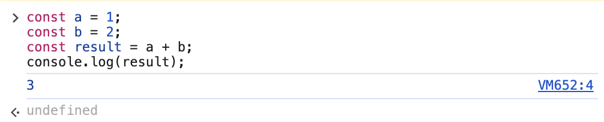
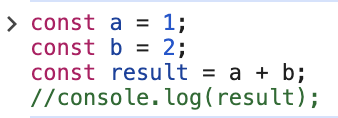
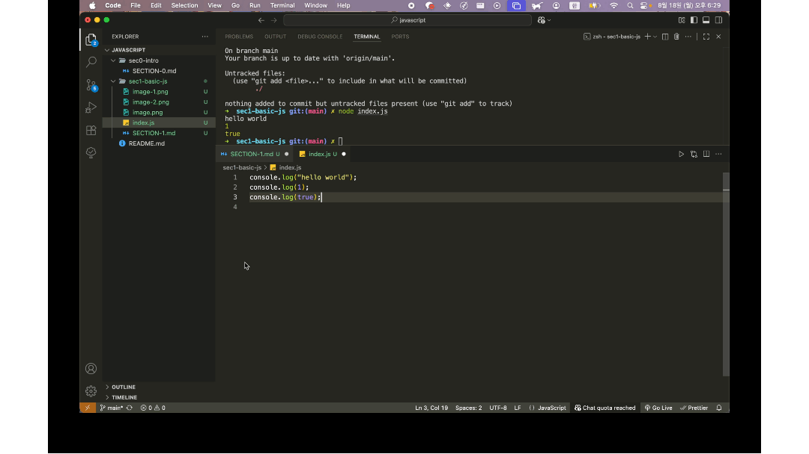
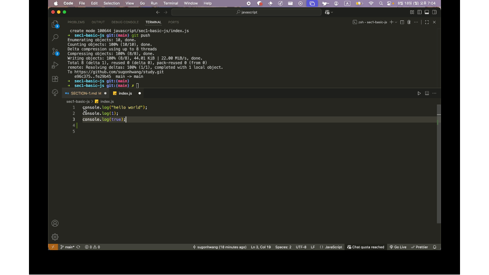
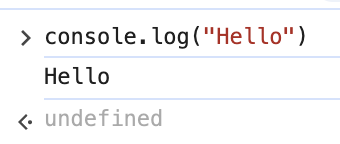
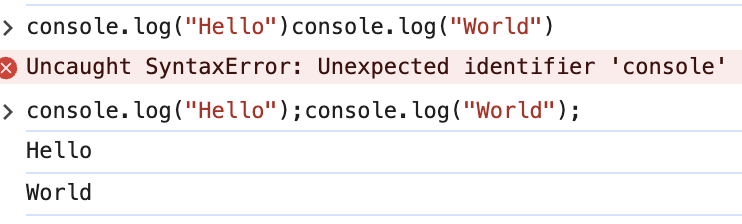

# 자바스크립트의 기본적인 사용

## 목차

[1. 콘솔 활용하기](#1-콘솔-활용하기)<br>
[2. 주석과 세미콜론](#2-주석과-세미콜론)<br>
[3. 변수와 상수 - 데이터를 담는 주머니](#3-변수와-상수--데이터를-담는-주머니)<br>
[4. 회고](#4-회고)

---

<br>

# 1. 콘솔 활용하기

크롬, 엣지 등 브라우저의 개발자 모드에서 `console.log()`를 통해 사용할 수 있음<br>

#### 특징

- 소스코드의 흐름이나 동작에 방해를 하지 않음
- 사용자는 개발자 도구를 열어서 이 로그를 직접 확인하지 않는 이상 로그에 찍힌 내용을 확인 할 수 없음

#### 용도

- 주로 개발자가 간다한 디바깅을 위해 사용함
- 자바스크립트 요소들에 어떤 값들이 들어있는지 확인하기 위해 사용함

`console.log()` 외에 `console.error()`, `console.warn()` 등 다양한 메소드를 활용 가능함<br>

[console MDN 문서 보기](https://developer.mozilla.org/ko/docs/Web/API/console)

---

<br>

# 2. 주석과 세미콜론

### 2.1 주석

주석은 쉽게 말해 소스코드에 대한 설명 또는 메모라고 보면됨<br>
모든 소스코드를 개발자가 완벽히 이해하기 어려우므로 해당 소스코드에 대한 간단한 설명 또는 무엇을 위한 소스코드인지 메모할 때 주로 쓰임

```js
const a = 1;
const b = 2;
const result = a + b; // a와 b를 더한 값을 result에 대입
```

위와 같이 `const result = a + b`가 무엇을 위해 작성된것인지 사용자에게 알려줄 수 있음<br>
또한, 소스코드 자체에 주석 처리를 하면 브라우저는 해당 소스코드는 실행하지 않음.<br>

### 2.1.1 주석처리 하지 않은 소스코드


위 소스코드는 console.log(result); 를 주석처리 않았으므로 변수 a와 b에 들어간 값(1, 2)를 더한 3을 result에 저장하고,<br>
개발자 도구에서 console.log(result);에 의해 3이란 값이 찍히는것을 확인할 수 있음.

### 2.1.2 주석처리 한 소스코드

<br>
하지만 console.log(result); 를 주석처리하게 되면 개발자도구에서 3이 찍히지 않음<br>
소스코드를 주석처리하는 경우는 대부분 지금 당장은 필요없지만 추후에 다시 써야 할수도 있을 때 작성한 코드를 남겨놓기 위해 사용함

### 2.1.3 주석 처리 방법

위 예제와 같이 소스코드, 또는 소스코드를 제외한 다른 공간에 주석 처리를 함으로써 소스코드의 가독성을 높혀 줄 수 있는데<br>
주석은 코드 한 줄 또는 여러 줄을 주석처리 할 수도 있음.

#### 2.1.3.1 한 줄 주석처리

위 예시처럼 `//`를 사용하여 한 줄 주석처리가 가능한데, vscode에서는 주석 처리할 줄에서 `cmd + /`를 누르면 자동으로 주석처리가 됨<br>



#### 2.1.3.2 여러 줄 주석처리

여러 줄을 주석처리하는 방법은 2가지가 있음

- 한 줄 주석처리와 동일하게 주석할 줄을 드래그로 지정한 다음 `cmd + /`로 주석 처리
- 주석 처리할 시작 줄에서 `/*` 입력 > 주석 처리 할 끝 줄에서 `*/` 입력

  

### 2.2 세미콜론

프로그래밍 언어들 중 일부 언어는 소스코드 뒤에 항상 세미콜론(;)을 붙여야 함<br>
그러나 자바스크립트는 일반적인 소스코드의 형태라면 세미콜론을 붙이지 않아도 에러가 발생하지 않음<br>


하지만, 아래와 같은 경우엔 세미콜론을 반드시 붙여줘야 함



그러나 일반적으로 이러한 형태로 소스코드를 작성하지 않으므로 세미콜론은 자바스크립트에서 생략이 가능하나<br>
위와 같이 예외적인 상황에서 오류를 방지하기 위해 가급적 붙이는걸 습관화 해놓는것이 좋음

---

<br>

# 3. 변수와 상수 - 데이터를 담는 주머니

### 3.1 변수란?

값이 변경될 수 있는 수

#### 3.1.1 변수 선언 방법

자바스크립트가 나온지 얼마 되지 않았을 땐 `var`라는 키워드를 사용하여 변수 선언을 했음<br>
그러나, 이 키워드는 여러가지 문제가 있어 이후 업데이트 된 자바스크립트 버전에서는 변수를 선언할 때 `let`이라는 키워드로 변수 선언을 하도록 변경됨<br>

```js
// let 키워드를 이용한 변수 선언 방법
// let 변수명 = 초기값
let a = 1;
let b = 2;

a = 3; // let은 변수를 선언하는 키워드이므로 처음 선언된 변수의 값을 다시 재할당 할 수 있음
console.log(a); // 3
```

위와 같이 변수를 선언 값을 할당 또는 재할당 할 수 있음.<br>

#### let 사용 시 주의사항

```js
let a = 1;
let a = 2; // 처음 a라는 변수를 let으로 선언하면 똑같은 방법으로 변수 선언 불가능
```

만약 a라는 변수에 2를 할당하고 싶으면 재할당하는 방법으로 할당해야함<br>

> 위에 언급된 `var`는 이게 가능했는데, 이러한 문제가 있다보니 지금은 거의 사용하지 않음

### 3.2 상수란?

- 값이 변경되지 않는 수
- 상수는 변수와 반대로 한번 할당된 값을 다른 값으로 재할당 할 수 없음

#### 3.2.1 상수 선언 방법

`const` 키워드를 사용하여 선언하며 보통 상수를 선언할때 상수명을 대문자로 씀<br>

- 상수는 변수와 다르게 선언만 할 수 없음

```js
const PI; // 상수명만 선언 불가능
```

### 3.3 변수 및 상수 식별자 규칙

식별자는 위에 언급된 변수명, 상수명을 뜻함

#### 3.3.1 식별자 규칙

- 영문, 한글 및 유니코드 글자, 숫자 사용 가능

  ```js
  let abc = 1;
  const PI = 3.14;
  let 아무개 = 0;
  const 멍멍이 = "왈왈";
  let number1 = 1;
  ```

- 특수문자는 `$` 또는 `_`만 가능

  ```js
  let $abc = 0;
  const PI_number = 3.14;
  let @abc = 0; // 불가능
  const PI-number = 3.14; // 불가능
  ```

- 식별자는 숫자로 시작할 수 없음

  ```js
  let 1a = 0; // 불가능
  ```

- 공백(스페이스) 사용 불가

  ```js
  let number 1 = 0; // 불가능
  ```

#### 3.3.2 예약어

자바스크립트에서 이미 어떠한 의미를 가지고 있는 키워드로 변수 및 상수 선언 불가능

```js
const let = 0; // let은 변수를 선언하는 예약어(키워드)이므로 변수명으로 사용 불가
```

---

<br>

# 4. 회고

js 스터디 2일차, 스터디를 하면서 계속 드는 걱정거리가 있다.

_**지금 js를 완전 처음부터 다시 공부하고 있는데 과연 이렇게 하는게 맞을까?**_<br>

시간이 오래 걸리더라도 차근차근 해보겠다는 불과 어제 했던 다짐이 하루아침에 흔들린다.<br>
차라리 프로젝트를 만들어보면서 공부하는게 더 빠르고 효과적이지 않을까? 라는 생각이 들면서도 한편으로는

_**내가 지금 계속 갈피를 못잡다 보면 경험상 제풀에 지치거나 이런 고민에 대한 스트레스로 스터디를 또 안할것 같다는 생각이 든다.**_

그저 하루에 한 강의씩 듣는 원칙 때문에 억지로 듣는건 아닌지... 내 스스로에게 의구심이 들고 있다.<br>
일단 초반 내용은 최대한 빠르게 진도를 나가면서 주제를 하나 정해서 바닐라 프로젝트를 병행해봐야겠다.
